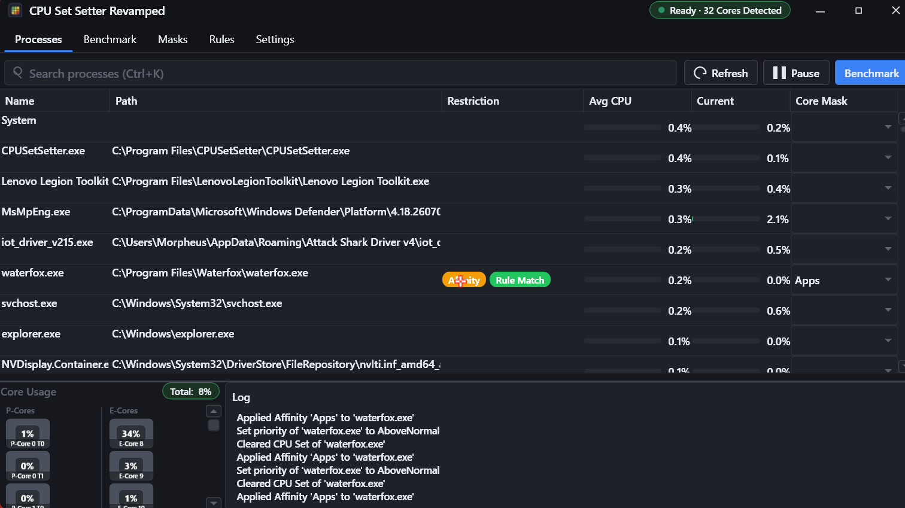
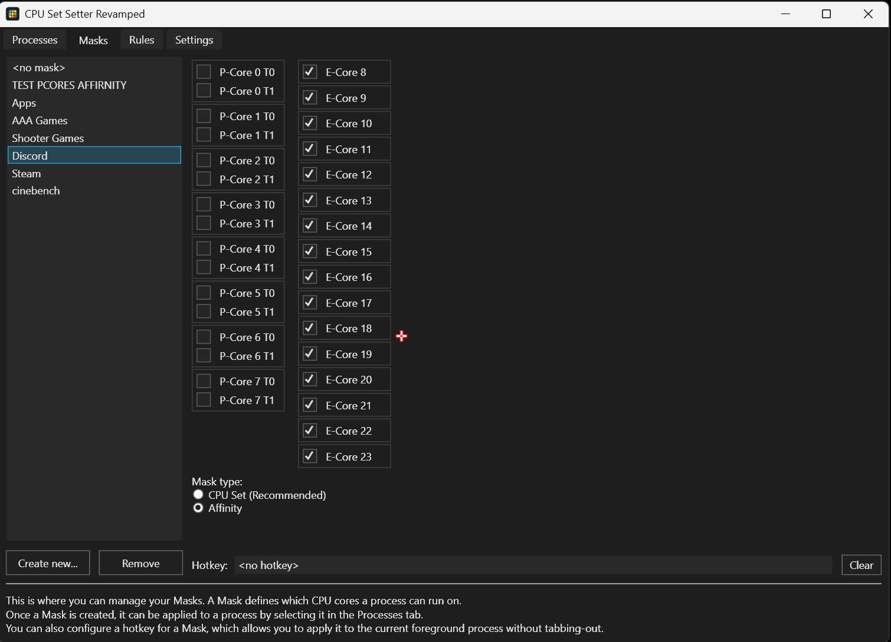

# CPU Set Setter Revamped

    

Make your games and apps run on the right CPU cores &mdash; for smoother performance on AMD Dual-CCD and Intel Hybrid processors. **CPU Set Setter Revamped** is a maintained fork of [CPU Set Setter](https://github.com/SimonvBez/CPUSetSetter) by [SimonvBez](https://github.com/SimonvBez), with CPU Set correctness fixes and a per-core usage heatmap.

**Requirements:**
- **Windows 10+**
- **.NET Desktop Runtime 10** (Follow in-app instructions)

# What's new in Revamped
- **CPU Sets now apply to running threads.** The OS only applies a process default CPU Set to threads created *after* it is set; Revamped also pins every existing thread, so a CPU Set takes effect immediately instead of "eventually" (or never for long-lived processes).
- **Affinity and CPU Sets can no longer conflict.** The other restriction type is always cleared before applying a mask, fixing the stale-affinity "empty intersection" where threads refused to move.
- **"Clear mask on close" actually clears.** Both restriction types are removed, instead of failing with an error.
- **Per-core CPU usage heatmap.** Click a process to see its per-core usage bars, color-coded by load (gray to red), with an only-used-cores filter and a busiest-cores summary.
- **Honest per-core numbers.** Windows reports a stale "ideal processor" for CPU-Set-confined threads (it keeps claiming the E-cores while the thread runs on a P-core). Revamped redistributes that misplaced usage into the active CPU Set's cores, so the heatmap matches reality.
- **Live restriction read-back.** The process details row shows the restriction that is *actually* applied (CPU Set IDs/cores or Affinity mask) straight from the OS.

See [CHANGELOG.md](CHANGELOG.md) for the full list.

# What it does
Windows tries its best to schedule tasks automatically, but it may often not be optimal. CPU Set Setter gives you control: you decide which cores your games and apps can use. This tool brings quick and easy access to **CPU Sets** &mdash; almost the same as Affinity, but better &mdash; for free.

# Common use cases / why you'd use this

## CCD locking; it's like parking, but better! (AMD Ryzen 9)
On dual-CCD CPUs, games can see big performance improvements when they are locked to the cores on a single CCD, especially on Ryzen 9 X3D CPUs. AMD and Windows usually accomplish this by **turning off** the other CCD (called parking), but this means background processes will now also be forced onto the same CCD as the game, leading to lower and less consistent framerates.

Ryzen 9 CPUs will see the largest benefit with CPU Set Setter! Especially when gaming and multitasking (streaming/rendering/etc) simutaniously.

## P-core locking (Intel 12th gen and up)
Windows does its best to schedule processes automatically, but manual control over which cores a game and background processes can use will improve performance in some scenarios.

## Soft-disabling SMT/HyperThreading (almost all CPUs, both Intel and AMD)
By restricting a program to only use the even (or uneven) cores you can soft-disable SMT/HT. Some games and programs (like Far Cry 6) may see an increase in performance by doing this.

This can be done in combination with the uses cases above.
 
For 5800X3D, 7800X3D and 9800X3D CPUs, this is probably the most/only useful tweak you can use.

# Experimentation is key
To quickly find out which core configuration works best for a certain game, CPU Set Setter provides Hotkey support to change/clear a program's Core Mask on the fly, so you can experiment quickly without having to even tab-out of your game.

# Setup/Installation (IMPORTANT, FOLLOW THIS)
To most optimally use CPU Set Setter, you may have to first follow some prerequisites depending on your CPU. See:
 
[AMD CPU setup](docs/setup/AMD.md)
 
[Intel CPU setup](docs/setup/Intel.md)

# Screenshots

# CPU Sets vs Affinity
But what are these CPU Sets you speak of? Aren't they just Affinities?
 
CPU Sets achieve the same results as Affinities; restricting which cores a process can use, but come with some subtle differences:
- **Affinity** = Hard lock (some games crash/freeze)
- **CPU Set** = Very strong hint but may be deviated from when necessary (more stable, works with more games)
- Bonus: CPU Sets require fewer process privileges to set, allowing them to work in games with anti-cheats too

This makes them better fit in almost every scenario.

# Credits
CPU Set Setter Revamped builds on the excellent work of [CPU Set Setter](https://github.com/SimonvBez/CPUSetSetter) by [SimonvBez](https://github.com/SimonvBez) &mdash; the core app, CPU Sets/Affinity handling, rules, hotkeys and masks are all theirs. This fork adds fixes and the per-core usage heatmap on top of that foundation. Thanks for making it free and open-source!

# Donations
CPU Set Setter Revamped is free and open-source, just like the original. If you appreciate the project, consider supporting the original author:
 
- Become a [GitHub sponsor](https://github.com/sponsors/SimonvBez)
- Donate directly with [PayPal](https://paypal.me/SimonvBez)

It'd be infinitely appreciated and will help maintain and expand the tool in the future.
